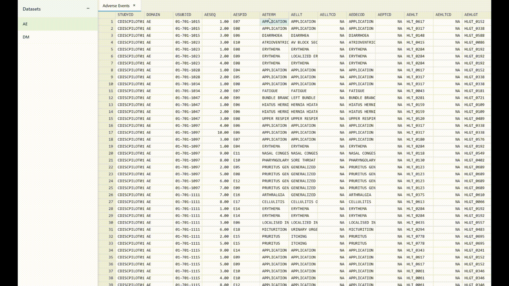
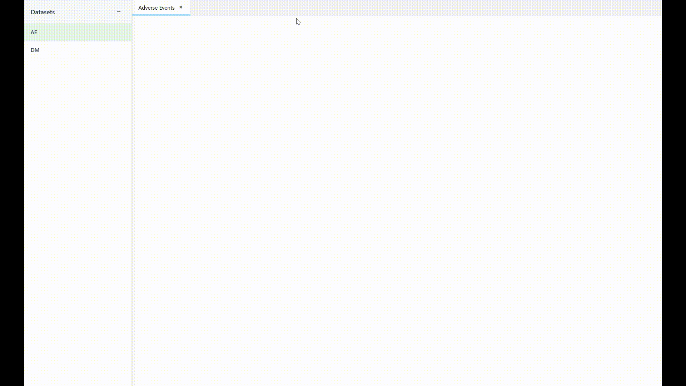

# Brian

A simple and powerful spreadsheet data viewer for CDISC clinical trial data, built with TypeScript. Brian provides interactive visualizations for clinical research data with features like multi-dataset support, column statistics, and responsive design.

## Features

- 📊 **Multi-dataset visualization** with tabbed interface
- 📈 **Column statistics** and data analysis
- 🎨 **Responsive design** that works on all screen sizes
- 🔧 **TypeScript support** with full type definitions
- 🏥 **CDISC format support** for clinical trial data
- ⚡ **High performance** with virtual scrolling
- 🎯 **Easy integration** with existing applications

## Demo




## Installation

### NPM

```bash
npm install brian
```

### Yarn

```bash
yarn add brian
```

### Bun

```bash
bun add brian
```

## Quick Start

### Basic Usage

```javascript
import { MultiDatasetVisualizer, CdiscDataProvider } from "brian";
import "brian/style.css"; // Import default styles

// Your CDISC dataset
const dataset = {
  name: "DM",
  label: "Demographics",
  columns: [
    { itemOID: "DM.STUDYID", name: "STUDYID", label: "Study Identifier", dataType: "string", length: 12 },
    { itemOID: "DM.AGE", name: "AGE", label: "Age", dataType: "integer", length: 8 },
    // ... more columns
  ],
  rows: [
    ["STUDY01", 65],
    ["STUDY01", 72],
    // ... more rows
  ],
  // ... other required CDISC fields
};

// Create visualizer
const container = document.getElementById("spreadsheet-container");
const visualizer = new MultiDatasetVisualizer(container, {
  width: 800,
  height: 600,
  dateFormat: "yyyy-MM-dd",
  numberFormat: { minimumFractionDigits: 0, maximumFractionDigits: 2 },
});

// Add dataset
const dataProvider = new CdiscDataProvider(dataset);
await visualizer.addDataset("dm", "Demographics", dataProvider);
```

### HTML Example

```html
<!DOCTYPE html>
<html>
  <head>
    <title>Brian Example</title>
    <link rel="stylesheet" href="node_modules/brian/dist/style.css" />
  </head>
  <body>
    <div id="spreadsheet-container" style="width: 100%; height: 600px;"></div>

    <script type="module">
      import { MultiDatasetVisualizer, CdiscDataProvider } from "./node_modules/brian/dist/index.es.js";

      // Your code here
    </script>
  </body>
</html>
```

## API Reference

### MultiDatasetVisualizer

The main component for displaying multiple datasets in a tabbed interface.

```typescript
constructor(parent: HTMLElement, options?: SpreadsheetOptions)
```

#### Methods

- `addDataset(id: string, name: string, dataProvider: DataProvider): Promise<void>`
- `switchToDataset(id: string): Promise<void>`
- `closeDataset(id: string): void`
- `getActiveDatasetId(): string | null`
- `getDatasetIds(): string[]`

#### Options

```typescript
interface SpreadsheetOptions {
  width?: number;
  height?: number;
  minHeight?: number;
  minWidth?: number;
  cellHeight?: number;
  dateFormat?: string;
  datetimeFormat?: string;
  numberFormat?: Intl.NumberFormatOptions;
  // ... many more styling options
}
```

### DatasetPanel

A side panel component for managing multiple datasets.

```typescript
constructor(parent: HTMLElement, visualizer: MultiDatasetVisualizer)
```

#### Methods

- `addDataset(id: string, key: string, name: string, dataset: CdiscDataset): void`
- `markDatasetAsUnloaded(id: string): void`
- `setOnToggleCallback(callback: (isMinimized: boolean) => void): void`

### CdiscDataProvider

Data provider for CDISC format datasets.

```typescript
constructor(dataset: CdiscDataset)
```

#### Methods

- `getMetadata(): Promise<DatasetMetadata>`
- `fetchData(startRow: number, endRow: number, startCol: number, endCol: number): Promise<any[][]>`

### Data Types

```typescript
interface CdiscDataset {
  datasetJSONCreationDateTime: string;
  datasetJSONVersion: string;
  fileOID: string;
  name: string;
  label: string;
  columns: CdiscColumn[];
  rows: (string | number | Date | boolean | null)[][];
  // ... other CDISC fields
}

interface CdiscColumn {
  itemOID: string;
  name: string;
  label: string;
  dataType: string;
  length: number;
  keySequence?: number;
  format?: string;
}
```

## Development

### Prerequisites

- [Bun](https://bun.sh/) (latest version)
- Node.js (for examples)

### Setup

```bash
# Install dependencies
bun install

# Start development server
bun dev

# Build for production
bun run build

# Build library for NPM
bun run build:lib
```

### Project Structure

```
brian/
├── src/
│   ├── components/          # UI components
│   │   ├── MultiDatasetVisualizer/
│   │   ├── DatasetPanel/
│   │   └── SpreadsheetVisualizer/
│   ├── data/               # Data types and providers
│   └── styles/             # SCSS styles
├── example/                # Usage examples
├── dist/                   # Built library (generated)
└── docs/                   # Documentation
```

## Browser Support

- Chrome 90+
- Firefox 88+
- Safari 14+
- Edge 90+

## Contributing

1. Fork the repository
2. Create your feature branch (`git checkout -b feature/amazing-feature`)
3. Commit your changes (`git commit -m 'Add some amazing feature'`)
4. Push to the branch (`git push origin feature/amazing-feature`)
5. Open a Pull Request

## License

This project is licensed under the MIT License - see the LICENSE file for details.

## Changelog

See [CHANGELOG](CHANGELOG) for version history and updates.
